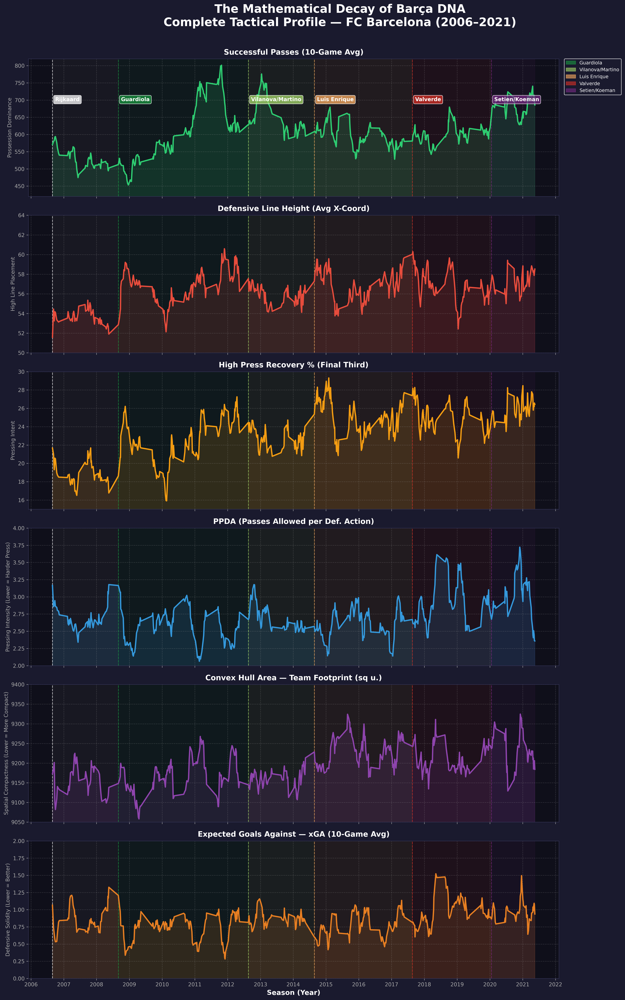
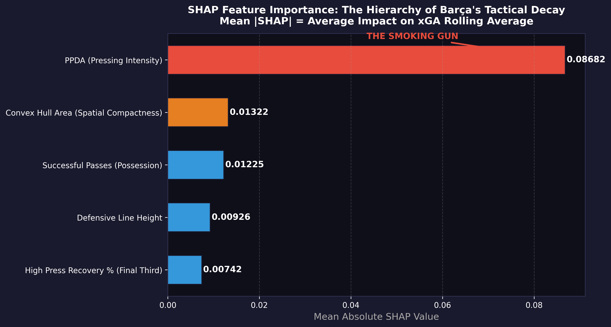

# The Mathematical Decay of Barça DNA

**Quantifying FC Barcelona's Tactical Identity Collapse Through 
Regression and Explainable Machine Learning (2006–2021)**

*AUA BS Computer Science Capstone Project — Vahe Vahanyan | 
Supervisor: Narek Sahakyan | 2025*

---

## Overview

When Pep Guardiola left FC Barcelona in 2012, the club's defensive 
record deteriorated measurably. Expected Goals Against rose from 
0.71 per match under Guardiola to 0.98 per match under Valverde. 
The common explanation was ageing players and poor recruitment. 
This project proposes a more fundamental answer: the decline was 
systemic, driven by the erosion of the tactical principles that 
had made the team defensively cohesive.

Using 1,896,905 StatsBomb event-level records across 501 La Liga 
matches from 2006 to 2021, this project quantifies the relationship 
between FC Barcelona's tactical identity and their defensive outcomes 
through a three-layer analytical framework.

---

## Key Findings

- **4 of 5** tactical DNA features shifted significantly between 
the Guardiola and Valverde eras (Welch's T-tests, α = 0.05)
- The OLS macro-trend model explains **41.6%** of the variance in 
Barcelona's rolling defensive trend (R² = 0.416, F-test p < 0.001)
- **PPDA** (pressing intensity) is the dominant driver with a mean 
absolute SHAP value **6.6 times greater** than the next most 
influential feature, independently confirmed by both OLS and SHAP
- Possession metrics showed **no significant predictive power** — 
Barcelona maintained similar ball retention across eras, but stopped 
pressing when they lost it

---

## Analytical Framework

### Layer 1 — Statistical Significance Testing
Welch's independent samples T-tests comparing the Guardiola era 
(n=136 matches) against the Valverde era (n=84 matches) across 
all five tactical DNA features and xGA.

### Layer 2 — OLS Macro-Trend Model
Ordinary Least Squares regression fitted on 10-game rolling averages 
of all five features to predict rolling Expected Goals Against. 
Features standardised before fitting for direct coefficient 
comparability.

### Layer 3 — SHAP Explainability Analysis
SHAP TreeExplainer applied to a Random Forest model trained on 
rolling average features to identify the dominant driver of 
Barcelona's defensive trend without assuming linearity.

---

## Tactical DNA Features

| Feature | Description |
|---|---|
| PPDA | Passes per Defensive Action — pressing intensity |
| Defensive Line Height | Mean x-coordinate of all defensive actions |
| Convex Hull Area | Geometric spatial compactness of defensive shape |
| High Turnover % | Proportion of defensive actions in the final third |
| Successful Passes | Total completed passes — possession dominance |

**Target variable:** Expected Goals Against (xGA) — 
shot-quality-adjusted defensive vulnerability measure

---

---

## Tech Stack

- **Python 3.x**
- **statsbombpy** — StatsBomb open event data access
- **pandas / numpy** — Data processing and feature engineering
- **scipy** — Welch's T-tests
- **scikit-learn** — Random Forest models
- **statsmodels** — OLS regression
- **shap** — SHAP explainability analysis
- **matplotlib / seaborn** — Visualisation

---

## Data Source

All data sourced from [StatsBomb Open Data](https://github.com/statsbomb/open-data), 
accessed via the `statsbombpy` Python library. StatsBomb provides 
free event-level data for research and educational purposes.

```python
pip install statsbombpy
```

---

## Results





---

## Citation

If you use this work, please cite:

Vahanyan, V. (2025). The Mathematical Decay of Barça DNA:
Quantifying FC Barcelona's Tactical Identity Collapse Through
Regression and Explainable Machine Learning (2006–2021).
AUA BS Computer Science Capstone Project.
